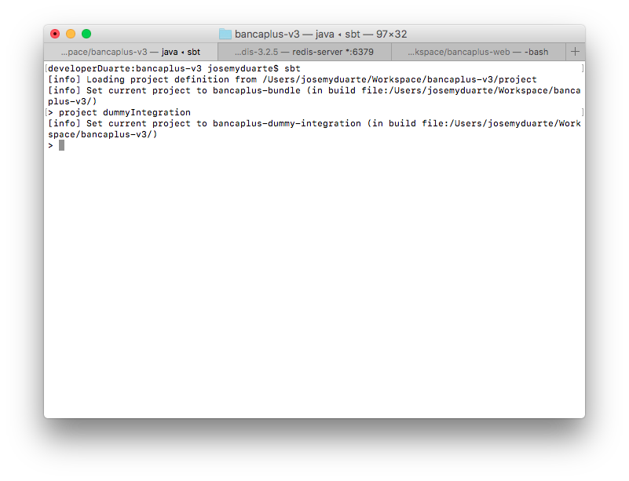
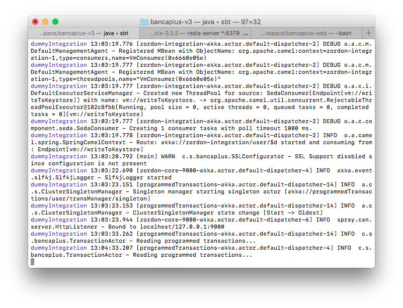

# Banca+ Multicanal Transaccional

_Acá va un párrafo que describa lo que es el proyecto_

## Despliegue Local

### Requerimientos: 📋

* [intellij](https://www.jetbrains.com/idea/)
* [Scala](http://scala-lang.org/download/install.html)
* [SBT](http://www.scala-sbt.org/release/docs/Installing-sbt-on-Mac.html)
* [Redis](http://redis.io/download)

### Instrucciones: 🔧

_Una vez clonado el repositorio, y teniendo una instancia de Redis en ejecución, abri una terminal y situarse en el directorio del proyecto. Una vez allí, ejecutar:_

`> sbt`


_Al culminar, se habrán descargado algunas dependencias, razón por la cual, la primera vez puede tomar cierto tiempo. Luego, para levantar localmente el proyecto con la integración Dummy, debe cambiar al proyecto ejecutando:_

`> project  dummyIntegration`



_Luego para correr el proyecto, ejecutar:_

`> ~dev:run`


_El proyecto se compilará y finalmente se encontrará disponible en el puerto 9000, todos los servicios que provee bancaplus-v3._



_Podrá hacer uso del swgger que el mismo proyecto provee en la dirección: [http://localhost:8080/swagger-ui/index.html](http://localhost:8080/swagger-ui/index.html?url=http://localhost:9000/api.json#/)_


## Ejecutando las pruebas ⚙️

_Explica como ejecutar las pruebas automatizadas para este sistema_

### Analice las pruebas end-to-end 🔩

_Explica que verifican estas pruebas y por qué_

```
Da un ejemplo
```

### Y las pruebas de estilo de codificación ⌨️

_Explica que verifican estas pruebas y por qué_

```
Da un ejemplo
```

## Deployment 📦

_Agrega notas adicionales sobre como hacer deploy_

## Construido con 🛠️

_Menciona las herramientas que utilizaste para crear tu proyecto_

* [Dropwizard](http://www.dropwizard.io/1.0.2/docs/) - El framework web usado
* [Maven](https://maven.apache.org/) - Manejador de dependencias
* [ROME](https://rometools.github.io/rome/) - Usado para generar RSS

## Contribuyendo 🖇️

Por favor lee el [CONTRIBUTING.md](https://gist.github.com/villanuevand/xxxxxx) para detalles de nuestro código de conducta, y el proceso para enviarnos pull requests.

## Wiki 📖

Puedes encontrar mucho más de cómo utilizar este proyecto en nuestra [Wiki](https://github.com/tu/proyecto/wiki)

## Versionado 📌

Usamos [SemVer](http://semver.org/) para el versionado. Para todas las versiones disponibles, mira los [tags en este repositorio](https://github.com/tu/proyecto/tags).

## Autores ✒️

_Menciona a todos aquellos que ayudaron a levantar el proyecto desde sus inicios_

* **Andrés Villanueva** - *Trabajo Inicial* - [villanuevand](https://github.com/villanuevand)
* **Fulanito Detal** - *Documentación* - [fulanitodetal](#fulanito-de-tal)

También puedes mirar la lista de todos los [contribuyentes](https://github.com/your/project/contributors) quíenes han participado en este proyecto. 

## Licencia 📄

Este proyecto está bajo la Licencia (Tu Licencia) - mira el archivo [LICENSE.md](LICENSE.md) para detalles

## Expresiones de Gratitud 🎁

* Comenta a otros sobre este proyecto 📢
* Invita una cerveza 🍺 a alguien del equipo. 
* Da las gracias públicamente 🤓.
* etc.


---
⌨️ con ❤️ por [Villanuevand](https://github.com/Villanuevand) 😊
