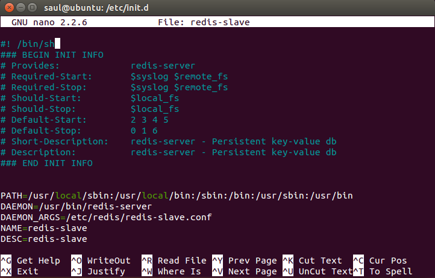

# Configuración de Cluster Redis

Es importante que en ambientes de calidad y producción, se configure Redis como un clúster y que
Banca+ este configurado apropiadamente para comunicarse con cualquiera de los nodos del clúster.

A partir de Redis 3.0 esta soportado el modo clúster, y debe ser usada esta versión o superior
al utilizar Banca+.

## Instalación del clúster

Se requieren de al menos 3 nodos para poder configurar un clúster de redis.

### Configurando con 3 nodos (maestro/esclavo en cada uno)

En esta configuración se utilizan tres servidores. En cada servidor se corre
un redis en modo maestro y un redis en modo esclavo. La distribución de los maestros
y los esclavos permite que el clúster sobreviva a la caída de uno de los nodos. Esto es,
con dos de los tres servidores activos, el clúster puede operar normalmente.

```
  Servidor1         Servidor2         Servidor3
     M1                M2                M3
     S2                S3                S1
```

En el ejemplo, si cualquiera de `Servidor1`, `Servidor2` o `Servidor3` falla, el clúster
sigue operando. Si al menos dos servidores fallan, el clúster fallará.

Es importante que en esta configuración, cuando un servidor que estaba caído se recupere,
que el mismo retome el rol de maestro en uno de sus servidores redis. Caso contrario
el clúster quedará en un estado en el cual el fallo de un único servidor produzca el fallo
del clúster. Esto se puede resolver a través del script de arranque de redis, ejecutando el comando
[`CLUSTER FAILOVER`](http://redis.io/commands/cluster-failover) en el servidor de redis recuperado
luego que el mismo arranca.

### Configuración con 6 nodos (3 maestros, 3 esclavos)

En esta configuración, existen tres servidores en modo maestro y tres servidores
en modo esclavo. El clúster puede sobrevivir la caida de hasta tres servidores siempre
y cuando se mantenga activo al menos un maestro o un esclavo de cada parte del clúster.

```
  Servidor1     Servidor2     Servidor3     Servidor4     Servidor5    Servidor6
     M1            M2            M3            S1            S2           S3
```

En este ejemplo si `Servidor1`, `Servidor2` y `Servidor3` fallan, el clúster sigue operando.
Sin embargo, si `Servidor1` y `Servidor4` fallan, el cluster fallará.

### Instrucciones

1. Instalar redis en todos los nodos. Esto puede hacerse a través del manejador de paquetes
   del sistema operativo o bajando el código fuente. Para más información revisar:
   
    - [Instalar redis-server en ubuntu](http://linuxg.net/how-to-install-redis-server-3-0-0-on-ubuntu-14-10-ubuntu-14-04-ubuntu-12-04-and-derivative-systems/)
    - [Instrucciones para Ubuntu 16.04 desde las fuentes](https://www.digitalocean.com/community/tutorials/how-to-install-and-configure-redis-on-ubuntu-16-04),
    - [Redis para Windows](https://github.com/MSOpenTech/Redis) (revisar los releases)

   La vía más rapida y sencilla es instalar el paquete `redis-server` si estamos en ubuntu.
   O el instalador de windows.

2. Tener definidos los nombres de los servidores (o sus direcciones IP en su defecto). Para este ejemplo
   se realizará un despliegue con tres servidores:
    - servidor1 (172.16.1.1)
    - servidor2 (172.16.1.2)
    - servidor3 (172.16.1.3)

   En todos los servidores, redis escuchará a traves de los puertos 6379 (maestro) y 7000 (esclavo).

3. Copiar el script de arranque de redis. Necesitaremos dos servicios de redis en cada servidor.
   En ubuntu, si instalamos redis a través del paquete `redis-server`, el script está en
   `/etc/init.d/redis-server`. Copiar ejecutando el siguiente comando:
   `sudo cp /etc/init.d/redis-server /etc/init.d/redis-slave`
4. Modificar la copia del script de arranque para que use la configuración de esclavo:
   Abrir el archivo `/etc/init.d/redis-slave` y modificar el valor del parámtros `DAEMON_ARGS`
   a `/etc/redis/redis-slave.conf`. Cambiar `NAME` y `DESC` a `redis-slave`. Cambiar
   `PIDFILE` a `$RUNDIR/redis-slave.pid`.

    Un ejemplo del archivo modificado está [aqui](redis-slave).

   

5. Copiar el archivo de configuración de redis. En ubuntu ejecutar:
   `sudo cp /etc/redis/redis.conf /etc/redis/redis-slave.conf`

6. Modificar los siguientes parámetros de `/etc/redis/redis-slave.conf`:

   ```
   port 7000
   cluster-enabled yes
   cluster-config-file nodes-slave.conf
   appendonly yes
   appendfilename append-slave.aof
   ```

7. Modificar los siguientes parámetros de `etc/redis/redis.conf`:

   ```
   port 6379
   cluster-enabled yes
   cluster-config-file nodes-master.conf
   appendonly yes
   appendfilename append-master.aof
   ```

8. Modificar el script de arranque de `redis-server` para que tome el rol de maestro
   de manera automática cuando arranque. Esto implica agregar las siguienes líneas
   luego del arranque con `start-stop-daemon`:

   ```
   sleep 5
   redis-cli cluster failover
   ```

   El archivo [redis-server](redis-server) tiene un ejemplo de esto.

   En el arranque inicial enviar este comando producirá un error indicando:
   `ERR You should send CLUSTER FAILOVER to a slave`
   Esto es normal y no es un indicador de que hay un problema.

9. Arrancar los dos servicios
   `sudo service redis-server start`
   `sudo service redis-slave start`

   __Repetir los pasos 1-9 para cada servidor.__

10. Ya con todos los nodos en ejecución, crear el clúster. En cualquiera de los
    servidores (o en un equipo con acceso a los servidores) instalar:
     - ruby
     - librería de redis para ruby (`gem install redis`)
     - Script `redis-trib`. Este script puede descargar de la [página de redis](http://redis.io/download).
       Abrir el archivo comprimido. El script estará en `src/redis-trib.rb`.

11. Crear el cluster ejecutando `redis-trib` (suponiendo que el script está en la carpeta actual):

   ```
   ./redis-trib.rb create --replicas 1 servidor1:6379 servidor2:6379 servidor3:6379 \
    servidor2:7000 servidor3:7000 servidor1:7000
   ```

   Se mostrará una posible opción de configuración. Verificar que la distribución de los nodos esta acorde
   a lo indicado en el diagrama mostrado inicialmente en esta guía. Escribir `yes` para aceptar.

   Si todo es ejecutado correctamente, se debería ver un mensaje como el siguiente:
   `[OK] All 16384 slots covered`

12. Verificar que el failover funciona correctamente. Para esto:

    a. Visualizar el log de los servidores. En cada servidor correr
       `sudo tail -f /var/log/redis/redis-server.log`
 
    b. Apagar alguno de los tres servidores. Debería ocurrir una ventana breve de tiempo donde el clúster
       no está disponible para luego estar activo nuevamente. Esto se debe poder apreciar en los logs.
 
    c. Encender el nodo que se había apagado. Se debería verificar en los logs que se unen nuevamente los
       servidores previamente apagados al clúster.
 
    d. Repetir b y c con cada servidor. Si en algun momento el clúster falla solamente con dos servidores
       pudo ocurrir que:
        - No se colocó el comando `CLUSTER FAILOVER` en el arranque de redis-server (ver paso 8).
        - Uno de los esclavos no tomó control por algun fallo ajeno a la configuración del clúster (ver logs).

12. Configurar Banca+ a que use el clúster como almacén de datos:

    En el archivo `application.conf` colocar lo siguiente:

    ```
    redis = [
      {
        host = "servidor1"
        port = 6379
      },
      {
        host = "servidor2"
        port = 6379
      },
      {
        host = "servidor3"
        port = 6379
      },
      {
        host = "servidor1"
        port = 7000
      },
      {
        host = "servidor2"
        port = 7000
      },
      {
        host = "servidor3"
        port = 7000
      }
    ]
    ```

## Referencias

http://redis.io/topics/cluster-tutorial
