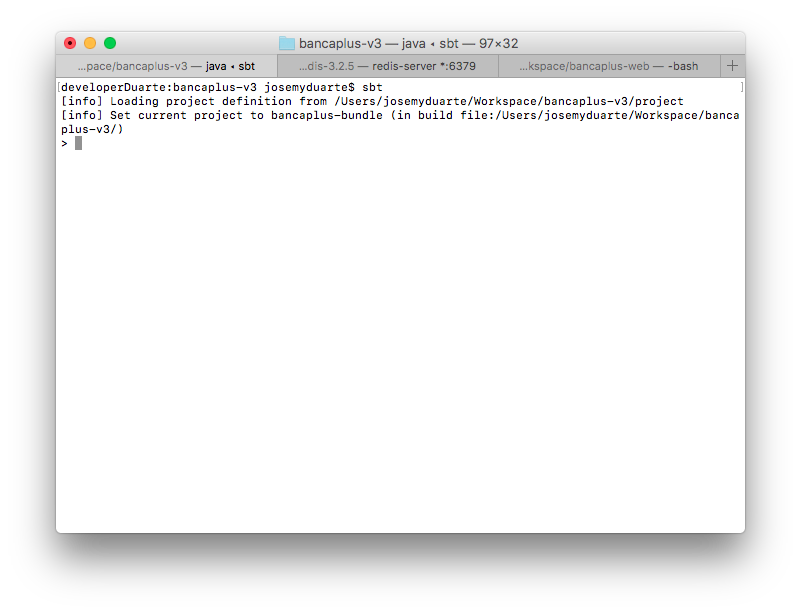
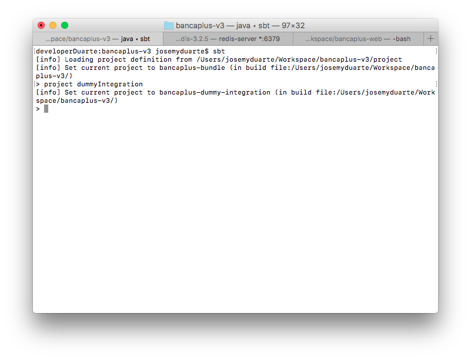
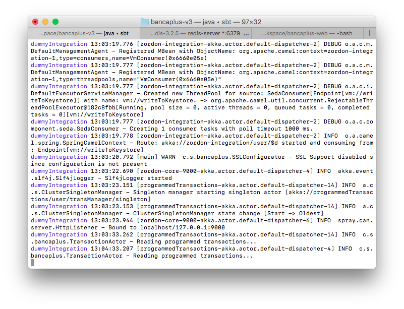

# Despliegue Local

## Requerimientos: 📋

* [intellij](https://www.jetbrains.com/idea/)
* [Scala](http://scala-lang.org/download/install.html)
* [SBT](http://www.scala-sbt.org/release/docs/Installing-sbt-on-Mac.html)
* [Redis](http://redis.io/download)

## Instrucciones: 🔧

_Una vez clonado el repositorio, y teniendo una instancia de Redis en ejecución, abri una terminal y situarse en el directorio del proyecto. Una vez allí, ejecutar:_

`> sbt`

_Al culminar, se habrán descargado algunas dependencias, razón por la cual, la primera vez puede tomar cierto tiempo. Luego, para levantar localmente el proyecto con la integración Dummy, debe cambiar al proyecto ejecutando:_

`> project  dummyIntegration`

_Luego para correr el proyecto, ejecutar:_

`> ~dev:run`

_El proyecto se compilará y finalmente se encontrará disponible en el puerto 9000, todos los servicios que provee bancaplus-v3._

_Podrá hacer uso del swgger que el mismo proyecto provee en la dirección: [http://localhost:8080/swagger-ui/index.html](http://localhost:8080/swagger-ui/index.html?url=http://localhost:9000/api.json#/)_

