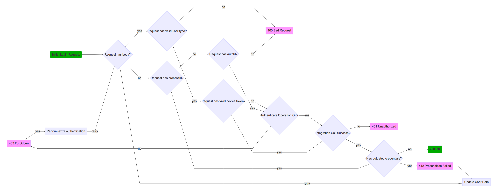

# About the login process

The login process of Banca+ is rather complex. This is due to the many use cases that the product must support.

Below is the flow diagram for the whole login process:

The login flow is made to ensure a few things:

1. Validate the user type (personal/corporate)
2. Validate any configured extra authentication mechanisms
3. Validate the login response from the integration
4. Validate that any outdated user information is updated by the user before logging in

